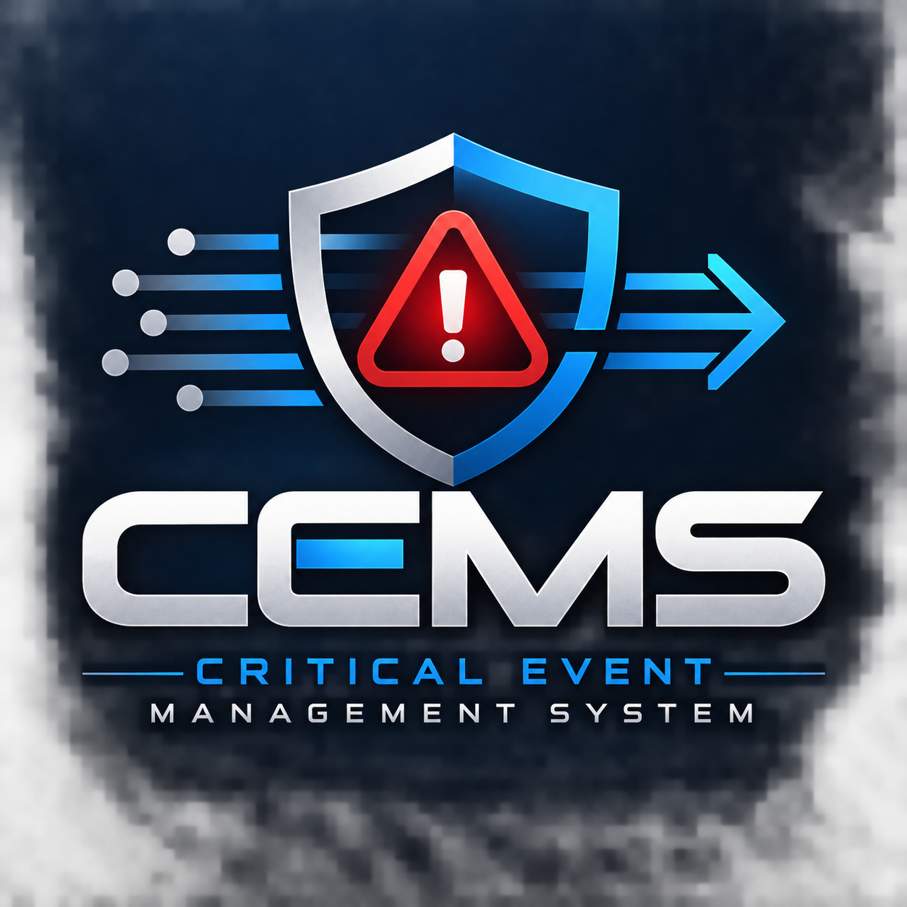
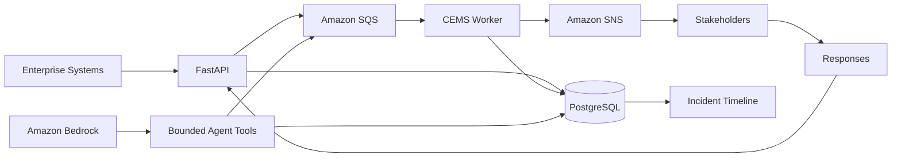
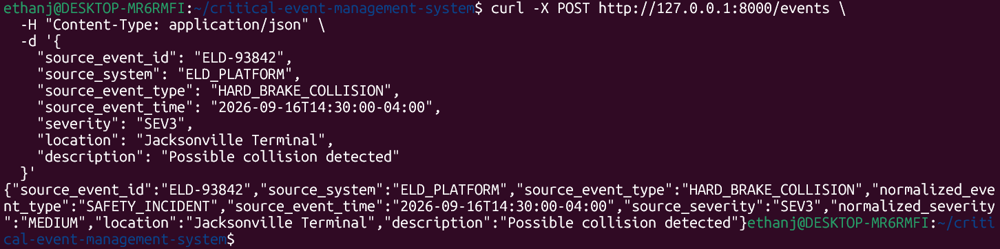

# CEMS — Critical Event Management System

  

CEMS is an **AI-assisted, event-driven critical event management system** designed to correlate enterprise events into incidents, coordinate stakeholder communication, and maintain a unified operational timeline.

I built CEMS around a problem I encountered while supporting business-critical systems: during critical events, information can become fragmented across systems, teams, and communication channels.

The goal was simple:

> **Create one coordinated path for managing critical-event information from detection through investigation and stakeholder response.**

## Architecture

CEMS follows a deliberately constrained architecture:

**One API • One Database • One Queue • One Worker • One Notification Service • One Bounded AI Agent**

## What CEMS Does

- Validates and normalizes incoming enterprise events
- Correlates related events into managed incidents
- Promotes incident severity as conditions change
- Maintains PostgreSQL as the operational system of record
- Processes incident activity asynchronously with Amazon SQS
- Isolates failed processing through a Dead-Letter Queue
- Applies deterministic stakeholder escalation rules
- Publishes notifications through Amazon SNS
- Correlates stakeholder responses back to incidents
- Maintains a chronological incident timeline
- Uses Amazon Bedrock for bounded AI-assisted investigation and system health monitoring

## Bounded AI Operations

CEMS integrates **Amazon Bedrock with Amazon Nova Lite** to assist with incident investigation.

Rather than giving the model unrestricted system access, the agent operates through four controlled tools:

- Retrieve incident context
- Add investigation notes
- Check system health
- Request a controlled worker restart action

The agent cannot arbitrarily modify infrastructure, IAM, incident severity, close incidents, execute shell commands, or perform destructive database operations.

This keeps **AI reasoning separate from operational authority**.

## Technology

**Application:** Python, FastAPI  
**Data:** PostgreSQL  
**AWS:** SQS, DLQ, SNS, ECR, Bedrock, IAM, CloudWatch  
**Infrastructure:** Terraform  
**Containers:** Docker

## Implementation Evidence

### Event Ingestion

CEMS accepting and processing an event through the FastAPI application.

Additional AWS evidence for the Bedrock agent, SQS/DLQ processing, and ECR container image will be added following final project validation.

## Cloud Architecture

The application was containerized with Docker and successfully published to **Amazon ECR**.

Terraform defines a private AWS target architecture including VPC networking, EC2 application hosts, an internal Application Load Balancer, RDS PostgreSQL, SQS/DLQ, SNS, IAM, and CloudWatch.

The infrastructure configuration successfully produced:

> **Terraform Plan: 33 to add, 0 to change, 0 to destroy**

The complete EC2/RDS/ALB environment was intentionally **not provisioned** to avoid unnecessary ongoing cloud costs. The Terraform configuration represents the validated target architecture.

## Engineering Decisions

Several important CEMS functions remain deterministic rather than AI-driven.

Incident correlation, severity handling, escalation rules, persistence, and message processing are controlled by application logic. AI assists with investigation and operational context.

I also deliberately excluded technologies that did not solve a necessary problem for this version—including Kubernetes, Kafka, multi-region deployment, additional microservices, and multiple AI agents.

The goal was not to build the largest possible technology stack.

**The goal was to understand why each component belonged in the system.**

## AI-Assisted Development

AI was used as an engineering accelerator throughout development to help translate architecture into implementation, challenge design decisions, troubleshoot failures, and accelerate iteration.

I remained responsible for defining the requirements, architecture, system behavior, testing, troubleshooting, security boundaries, and engineering tradeoffs.

## Documentation

For a deeper technical explanation of event processing, incident correlation, resilience, security, AWS architecture, AI guardrails, and design tradeoffs:

**[Read the CEMS Architecture Documentation](docs/architecture.md)**

## Repository Scope

This repository contains the public documentation and selected implementation evidence for CEMS.

The full application source code, database migrations, worker implementation, Terraform source, and internal configuration are maintained separately in a private repository.
