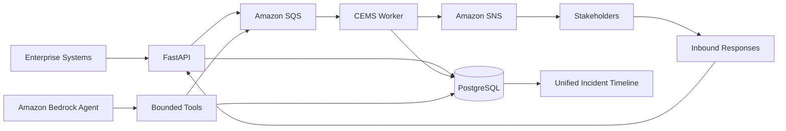

# CEMS Architecture

## System Purpose

CEMS establishes and maintains a coordinated communication path throughout the lifecycle of a critical event.

External enterprise systems generate events that are validated, normalized, persisted, correlated into incidents, processed asynchronously, and routed to appropriate stakeholders.

## Logical Architecture

## Event Lifecycle

1. An enterprise system submits an event.
2. FastAPI validates and normalizes the payload.
3. The event is persisted in PostgreSQL.
4. CEMS determines whether the event belongs to an active incident.
5. Incident severity is promoted when appropriate.
6. Incident processing is placed onto Amazon SQS.
7. The worker processes the message.
8. Deterministic escalation rules identify stakeholders.
9. Amazon SNS publishes outbound communications.
10. Stakeholder responses are correlated back to the incident.
11. Events and communications form the unified operational timeline.

## Incident Correlation

CEMS separates **source events** from **managed incidents**.

Multiple source events can therefore represent the same real-world critical event without creating independent incidents for every incoming message.

Related events are correlated using deterministic criteria including:

- Canonical event type
- Location
- Active incident state
- Event occurrence time
- Recent related activity

CEMS uses a rolling correlation window based on recent activity associated with an active incident.

Higher-severity correlated events can promote the severity of an existing incident. Incident severity is not automatically downgraded when a lower-severity event is received.

AI is intentionally excluded from incident correlation. Correlation and severity behavior remain deterministic application decisions.

## Data and System of Record

PostgreSQL serves as the system of record for CEMS.

The data model separates operational concepts including:

- Incidents
- Source events
- Incident messages
- Escalation rules
- Agent activity

This separation allows multiple events and communications to be associated with a single managed incident while preserving their individual history.

## Asynchronous Processing

Amazon SQS decouples API event ingestion from downstream incident processing.

CEMS uses typed queue messages so a worker can identify the operation represented by each message.

The worker consumes messages from SQS, retrieves the associated incident information, evaluates deterministic escalation rules, and performs the required downstream processing.

A message is deleted from the queue only after successful processing.

## Failure Isolation and DLQ

Failed messages remain available for retry rather than being immediately discarded.

After exceeding the configured retry threshold, AWS moves the message to the Dead-Letter Queue.

The CEMS configuration uses a maximum receive count of five attempts before DLQ isolation.

The DLQ provides a controlled location for investigating failures such as:

- Malformed messages
- Missing referenced data
- Persistent downstream failures
- Application defects
- Notification failures

CEMS does not automatically redrive DLQ messages.

A human operator should investigate the underlying failure before controlled replay to avoid repeatedly introducing a poison message into normal processing.

## Stakeholder Communication

CEMS uses deterministic escalation rules to determine which stakeholders should receive communication.

Rules can evaluate characteristics such as:

- Event type
- Incident severity
- Stakeholder role
- Required communication channel

Amazon SNS provides outbound notification capability.

Inbound stakeholder responses are submitted back to CEMS and correlated to the appropriate incident using a correlation identifier.

These communications become part of the incident's operational history.

## Unified Incident Timeline

CEMS exposes a unified chronological incident timeline.

The implemented timeline combines source events and incident messages associated with an incident.

This provides operators with a consolidated view of what occurred and creates structured context for incident investigation.

A future production version could extend the timeline to include additional operational records such as notification delivery and AI agent activity.

## Bounded AI Operations Agent

CEMS integrates Amazon Bedrock using Amazon Nova Lite.

The agent was designed around a key principle:

**AI reasoning capability should not automatically equal operational authority.**

Instead of giving the model unrestricted system access, CEMS exposes a small allowlisted toolset.

### Available Agent Tools

The agent can:

- Retrieve incident context
- Add investigation notes
- Check system health
- Request a controlled worker restart action

System-health inspection includes database availability and SQS/DLQ queue information.

The restart capability represents a bounded restart request rather than unrestricted process or infrastructure control.

### Agent Restrictions

The agent cannot:

- Execute arbitrary shell commands
- Modify IAM
- Modify AWS infrastructure
- Perform unrestricted database operations
- Change incident severity
- Close incidents
- Send arbitrary stakeholder communications
- Perform destructive remediation

Agent actions are designed to be auditable.

This creates a separation between **reasoning**, **tool access**, and **operational authority**.

## Container Architecture

The FastAPI application and worker are packaged using Docker.

The application image was successfully built locally and published to Amazon ECR.

The same application image can support different runtime responsibilities depending on the command used to start the container.

This provides a consistent application artifact while allowing API and worker processes to operate independently.

## AWS Target Architecture

Terraform defines the target AWS infrastructure for CEMS.

The target architecture includes:

- Amazon VPC
- Two private application subnets
- Two private database subnets
- Security groups
- Internal Application Load Balancer
- EC2 application hosts
- Amazon RDS PostgreSQL
- Amazon SQS
- Dead-Letter Queue
- Amazon SNS
- Amazon ECR
- AWS IAM
- Amazon CloudWatch

The design places application and database resources in private networking and restricts communication between infrastructure layers.

## Infrastructure as Code

Terraform is used to represent the target AWS environment.

The configuration was successfully formatted and validated.

The final Terraform plan produced:

**33 to add, 0 to change, 0 to destroy**

The complete EC2, RDS, and Application Load Balancer environment was intentionally **not provisioned**.

The Terraform configuration therefore represents a validated target architecture rather than a claim that the complete production-style environment is currently running in AWS.

This decision preserves the infrastructure design while avoiding unnecessary ongoing cloud costs for a portfolio project.

## Security Architecture

CEMS was designed around several security principles.

### Network Isolation

The target architecture uses:

- Private application subnets
- Private database subnets
- No public database access
- Internal load balancing
- Security-group-controlled communication

### Application-to-Database Access

Database connectivity is restricted to the application security group over PostgreSQL port 5432.

### Instance Security

The EC2 target configuration requires IMDSv2 and encrypted storage.

### IAM

Application permissions are separated through IAM policies for required AWS services.

The design follows least-privilege principles rather than granting broad administrative access.

### AI Security

The Bedrock agent can access only explicitly registered application tools.

The model itself does not receive unrestricted infrastructure, shell, database, or IAM authority.

### Secrets

Credentials, `.env` files, Terraform variable files containing sensitive values, and Terraform state are excluded from source control.

## Database Availability Design

The architecture was designed with database availability and durable event capture in mind.

The intended failure path is:

**Inbound event → validation → PostgreSQL persistence attempt**

If PostgreSQL is available, the event is persisted normally.

If PostgreSQL is unavailable, an important inbound write can be placed onto SQS for later replay.

The complete automatic database-outage replay mechanism is a designed extension and is not represented as fully implemented in the current version.

This distinction is intentional so the documented system accurately reflects implemented behavior.

## Persistence and Queue Atomicity

CEMS v1 persists an event to PostgreSQL and then sends downstream processing work to SQS.

Those operations are not a single atomic transaction.

A production-scale system could introduce a transactional outbox pattern to eliminate the possibility of a database commit succeeding while the subsequent queue operation fails.

An outbox was deliberately excluded from CEMS v1 to avoid adding infrastructure and implementation complexity that was not necessary to demonstrate the core architecture.

## High Availability

The Terraform target architecture supports a high-availability configuration with:

- Multiple application hosts
- Multiple Availability Zones
- Internal load balancing
- RDS Multi-AZ capability

The portfolio environment does not keep this infrastructure running continuously.

The high-availability configuration represents the intended production architecture rather than an always-on demo environment.

## Known Infrastructure Limitations

The Terraform-defined architecture intentionally stops short of a fully production-deployed environment.

Additional production work would include:

- Complete private AWS service connectivity through VPC endpoints or controlled egress
- Secure runtime secret injection
- Automated EC2 application bootstrap
- TLS termination
- Authentication and authorization
- Expanded monitoring and alerting
- Production deployment automation
- Additional operational health checks

These limitations are documented rather than hidden because understanding what remains is part of the engineering design.

## Design Tradeoffs

CEMS deliberately avoids unnecessary architectural complexity.

The project does not currently require:

- Kubernetes or EKS
- Kafka
- Redis
- Multiple microservices
- Multi-region deployment
- Multiple AI agents
- Vector databases
- Autonomous infrastructure remediation
- Complex frontend applications

Each additional technology would introduce operational overhead.

The architecture was therefore constrained to:

**One API. One database. One queue. One worker. One notification service. One bounded AI agent.**

The goal was not to demonstrate the largest possible technology stack.

The goal was to build a system where each major component addresses a specific operational requirement.

## Implemented vs. Target Architecture

### Implemented and Tested

- FastAPI event ingestion
- PostgreSQL persistence
- Event normalization
- Incident correlation
- Severity promotion
- Amazon SQS processing
- Dead-Letter Queue configuration
- Worker processing
- Deterministic escalation
- Amazon SNS publishing
- Inbound stakeholder responses
- Unified incident timeline
- Amazon Bedrock AI operations agent
- Bounded AI tool execution
- System health inspection
- Docker containerization
- Amazon ECR image publishing
- Terraform formatting
- Terraform validation
- Terraform infrastructure planning

### Designed or Defined for Production

- Private VPC deployment
- Internal Application Load Balancer
- EC2 application hosts
- RDS PostgreSQL
- Multi-AZ deployment
- Expanded CloudWatch monitoring
- Complete private AWS service connectivity
- Production secret management
- Automated deployment/bootstrap
- TLS
- Authentication and authorization
- Full database-outage replay

## Architecture Principle

CEMS was designed around a simple engineering principle:

> **Complexity should have to justify itself.**

AWS services, asynchronous processing, deterministic business logic, AI capabilities, resilience controls, and security boundaries were added where they addressed specific system requirements.

The result is an event-driven system that demonstrates not only cloud technologies, but the engineering decisions required to connect them into a coherent operational platform.
